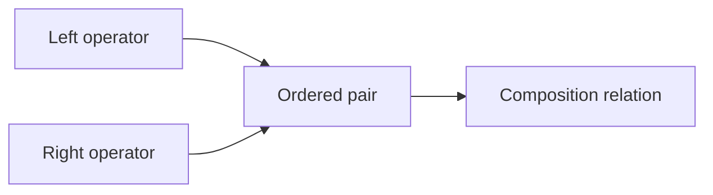

# Composition Flow

Composition describes sequencing among transformation operators.

The authoritative Lean definitions are in:
`SE/Transformation/Relation/Composition.lean` and
`SE/Transformation/Reference/Composition.lean`.

The reference registry mirror is in:
`reference/composition-rules.toml`.

Generated data is in:
`data/transformation/composition-registry.json`.

Effect-level necessary conditions are formalized separately in:
`SE/Transformation/Effect/Composition.lean`.

They constrain possible restoration and inverse-like behavior;
they do not derive the declared composition relation.

## Rule

- Composition describes sequencing.
