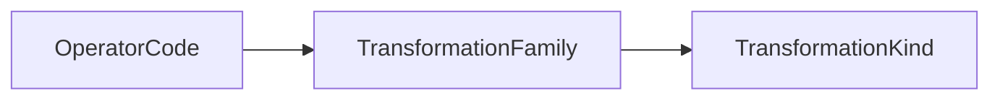

# Operator Taxonomy

The operator taxonomy classifies transformation operators through the Lean
taxonomy path.

The authoritative Lean definitions are in:
`SE/Transformation/Domain/`.

## Rule

- Operators name atomic changes.
- Families group operators.
- Kinds group families.
