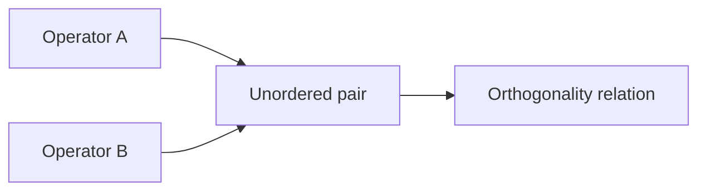

# Orthogonality Grid

Orthogonality records selected declared relations among
transformation operators.



The pair is unordered: orthogonality is symmetric.

The authoritative declared relations are in:

```text
SE/Transformation/Relation/Orthogonality.lean
SE/Transformation/Reference/Orthogonality.lean
```

Footprint-derived effect relationships are formalized separately in:
`SE/Transformation/Effect/Orthogonality.lean`.

`EffectsDisjoint` and `EffectsOverlap`
do not replace the declared orthogonality relation.

## Rule

- Orthogonality records declared pair relations.
- Effect predicates compare operator footprints.
- Composition describes sequencing.
