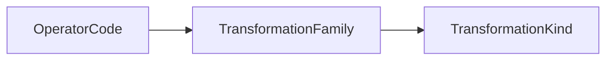

# SE Theory: Transformation

> Lean 4 formalization of foundational transformation theory for
> Structural Explainability (SE).

Transformation theory defines named atomic changes,
their taxonomy, their effect constraints,
and selected relations among transformation operators.

- [Transformation Vocabulary](./vocab.md)
- [Effect Semantics](./theory/effects.md)
- [Lean API Reference](https://structural-explainability.github.io/se-theory-transformation/lean/)
- [GitHub Repository](https://github.com/structural-explainability/se-theory-transformation)

## Scope

Transformation theory defines transformation kinds, families, operations,
atomic effect semantics, composition relations, and orthogonality relations.

Persistence judgments and operational policy are out of this scope.

## Authority

Lean source is authoritative for taxonomy semantics,
operator effect semantics, and structural relations.

The taxonomy path is:



`operatorFamily` and `familyKind` are the sole authoritative mappings.
Derived lists and reference artifacts mirror those functions.

`footprint` and `requirements` define the effect constraints for each operator.
`characteristic` is derived from the complete required-change condition.
`StateModel` defines the abstract semantics of atomic operator steps.

Composition and orthogonality are explicitly partial.
Absence of a rule means that this theory has not specified
a canonical relation for that pair.

Generated data mirrors the registered theory surface;
it is not an independent source of semantics.

## Build

```shell
lake build
lake test
lake lint
```

## Import

```lean
import SE.Transformation
```
