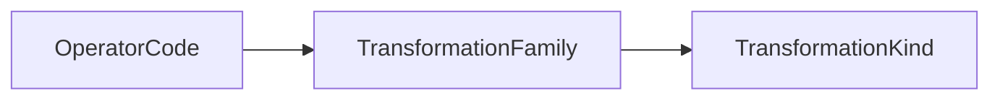

# Operator Vocabulary

Operators are named atomic transformation primitives.

Each operator names one intrinsic transformation.
Incidental effects belong to additional operator steps
rather than being folded into the primitive operation.

## Authority

The authoritative Lean definitions are in:
`SE/Transformation/Domain/Operator/`.

The semantic classification path is:

## Taxonomy Overview

Kinds are the broadest categories of change.
Families group related operations within a kind.
Operators are the named atomic transformations used by the theory.

The current vocabulary contains 7 transformation kinds,
14 transformation families, and 17 named operators.

| Kind           | Family         | Operators                  |
| -------------- | -------------- | -------------------------- |
| Contextual     | Contextual     | `BD` bind, `UB` unbind     |
| Normative      | Normative      | `AZ` authorize             |
| Observational  | Attestation    | `AT` attest                |
| Observational  | Projection     | `PR` project               |
| Observational  | Replication    | `CP` copy                  |
| Organizational | Containment    | `EM` embed                 |
| Organizational | Reorganization | `RO` reorder               |
| Relational     | Association    | `LK` link                  |
| Relational     | Migration      | `SH` shift                 |
| Structural     | Aggregation    | `MG` merge                 |
| Structural     | Decomposition  | `SP` split                 |
| Structural     | Scaling        | `CL` collapse, `EX` expand |
| Temporal       | Branching      | `BR` branch                |
| Temporal       | Versioning     | `RV` revert, `VS` version  |

This table is an overview of the taxonomy.
The authoritative mappings remain `operatorFamily` and `familyKind`.

`operatorFamily` is the sole operator-to-family mapping.
`familyKind` is the sole family-to-kind mapping.
`operatorKind` is derived from those two mappings.

The registry queries `operatorsInFamily`, `operatorsInKind`, and
`familiesInKind` are derived from the authoritative mappings
and canonical reference lists.

Operator effect constraints are defined separately by
`footprint` and `requirements`.

See [Effect Semantics](./effects.md).
