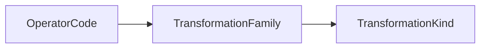

# Operator Vocabulary

Operators are named atomic transformation primitives.

Each operator names one intrinsic transformation.
Incidental effects belong to additional operator steps
rather than being folded into the primitive operation.

## Authority

The authoritative Lean definitions are in:
`SE/Transformation/Domain/Operator/`.

The semantic classification path is:

`operatorFamily` is the sole operator-to-family mapping.
`familyKind` is the sole family-to-kind mapping.
`operatorKind` is derived from those two mappings.

The registry queries `operatorsInFamily`, `operatorsInKind`, and
`familiesInKind` are derived from the authoritative mappings
and canonical reference lists.

Operator effect constraints are defined separately by
`footprint` and `requirements`.

See [Effect Semantics](./effects.md).
